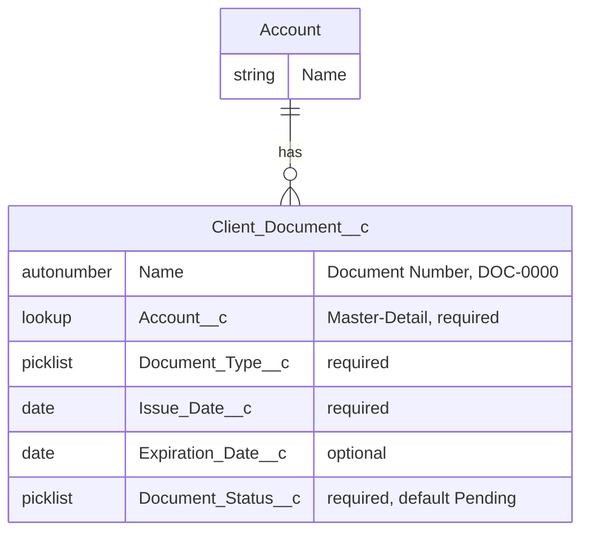

# Client Documents — Technical Documentation

Audience: developers, admins, and anyone deploying or extending this feature.

For business context see [business-documentation.md](business-documentation.md). For the original requirement, design trade-offs, and the deploy/fix log, see [requirement.md](requirement.md).

## Data model



`Client_Document__c` is a **Master-Detail child of Account**: it cannot exist without a parent Account, inherits Account's sharing (`sharingModel: ControlledByParent`), and is deleted (cascade) when its parent Account is deleted.

## Metadata inventory

| Type | API Name | Path |
|---|---|---|
| Custom Object | `Client_Document__c` | [force-app/main/default/objects/Client_Document__c/](../../force-app/main/default/objects/Client_Document__c/) |
| Custom Field | `Account__c` (Master-Detail → Account) | `.../fields/Account__c.field-meta.xml` |
| Custom Field | `Document_Type__c` (Picklist) | `.../fields/Document_Type__c.field-meta.xml` |
| Custom Field | `Issue_Date__c` (Date) | `.../fields/Issue_Date__c.field-meta.xml` |
| Custom Field | `Expiration_Date__c` (Date) | `.../fields/Expiration_Date__c.field-meta.xml` |
| Custom Field | `Document_Status__c` (Picklist) | `.../fields/Document_Status__c.field-meta.xml` |
| FlexiPage | `Client_Document_Record_Page` | [force-app/main/default/flexipages/](../../force-app/main/default/flexipages/) |
| Custom Tab | `Client_Document__c` | [force-app/main/default/tabs/](../../force-app/main/default/tabs/) |
| Permission Set | `Client_Document_Access` (full CRUD) | [force-app/main/default/permissionsets/](../../force-app/main/default/permissionsets/) |
| Permission Set | `Client_Document_ReadOnly` (read-only) | [force-app/main/default/permissionsets/](../../force-app/main/default/permissionsets/) |
| Object Translation | `Client_Document__c-cs` (Czech) | [force-app/main/default/objectTranslations/](../../force-app/main/default/objectTranslations/) |
| Object Translation | `Client_Document__c-sk` (Slovak) | [force-app/main/default/objectTranslations/](../../force-app/main/default/objectTranslations/) |

## Security model

Access is granted exclusively through the two Permission Sets — there is no profile-level access and no `viewAllRecords`/`modifyAllRecords` (no "View/Modify All Data" style overrides).

| | Client_Document_Access | Client_Document_ReadOnly |
|---|---|---|
| Account | Read | Read |
| Client_Document__c | Create, Read, Edit, Delete | Read |
| `Expiration_Date__c` FLS | Read/Edit | Read only |

Two platform rules shaped this design and are worth knowing before changing it:

- **Master-Detail fields and required fields cannot carry explicit Field-Level Security.** `Account__c` (Master-Detail) and the three required fields (`Document_Type__c`, `Issue_Date__c`, `Document_Status__c`) are *not* listed under `fieldPermissions` in either Permission Set — the platform grants/denies them implicitly based on object access. Only `Expiration_Date__c` (the one optional field) has an explicit `fieldPermissions` entry.
- **Reading a Master-Detail child requires Read on the parent.** Both Permission Sets grant `Account: Read` (nothing more) purely to satisfy this dependency — they don't grant any additional Account access.

## Deploying

```bash
# Deploy everything
sf project deploy start --source-dir force-app --target-org <org-alias>

# Assign access to a user
sf org assign permset --name Client_Document_Access --target-org <org-alias>
# or, for view-only access:
sf org assign permset --name Client_Document_ReadOnly --target-org <org-alias>
```

### Retrieving (to sync local source with an org)

```bash
sf project retrieve start --source-dir force-app/main/default/objects/Client_Document__c --target-org <org-alias>
```

Note: retrieving `objectTranslations` decomposes them into one `<Field>.fieldTranslation-meta.xml` per translated field (current SFDX source shape) rather than embedding them inline in the `.objectTranslation-meta.xml` file — this is expected, not a diff to "fix".

## Translations (cs / sk)

Field/object/picklist labels are translated via standard `CustomObjectTranslation` metadata — no Custom Labels are used since nothing here is generated dynamically in Apex/LWC.

Deploying the translation metadata does **not** make it visible by itself. For a user to see it:

1. In the target org: **Setup → Language Settings** (Company Settings) → enable **"Enable Platform-only Languages"**. This is required because Czech and Slovak are Salesforce *End-User Languages*, not *Fully Supported Languages* — without this toggle they don't even appear in the Translation Workbench's language picker.
2. **Setup → Translation Workbench → Translation Language Settings → New Language** → select **Czech**, mark **Active**, Save. Repeat for **Slovak**.
3. Each user sets their own personal **Language** (their profile/personal settings) to Czech or Slovak to see the translated labels.

Only the **Nominative** grammatical case is translated for the object's own label (`Klientský dokument` / `Klientské dokumenty`). Czech and Slovak have 5 more noun cases (Accusative, Genitive, Dative, Instrumental, Locative); retrieving the translation metadata returns placeholders for those, which are safe to leave blank (they're rarely used outside specific merge-field/report contexts).

## Known limitations / follow-ups

- No Salesforce Files/ContentVersion component — the object stores document *metadata* only, not the scanned file.
- `Document_Type__c` values (Identification Document, Contract, Invoice, Certificate, Other) are a placeholder set agreed for this exercise — validate against real business categories before go-live.
- No related list has been added to a custom Account FlexiPage, because none exists in this template repo yet; Master-Detail children appear automatically in the dynamic Related Lists component on the org's default Account page. If a custom Account page is introduced later, add "Client Documents" to it explicitly.
- No automation (validation rules, Flow, Apex triggers) and no reports/dashboards — none were requested for this iteration.
- `enableHistory` is `false` on the object — field history tracking can be turned on later if status-change auditing becomes a requirement.

## Sample/test data

Six sample records exist in the `training` org, covering all four statuses and several document types (see `business-documentation.md` for the exact list). They were created directly via `sf data create record` rather than a checked-in seed file; ask if you'd like them exported to `/data` for repeatable import into other orgs.
